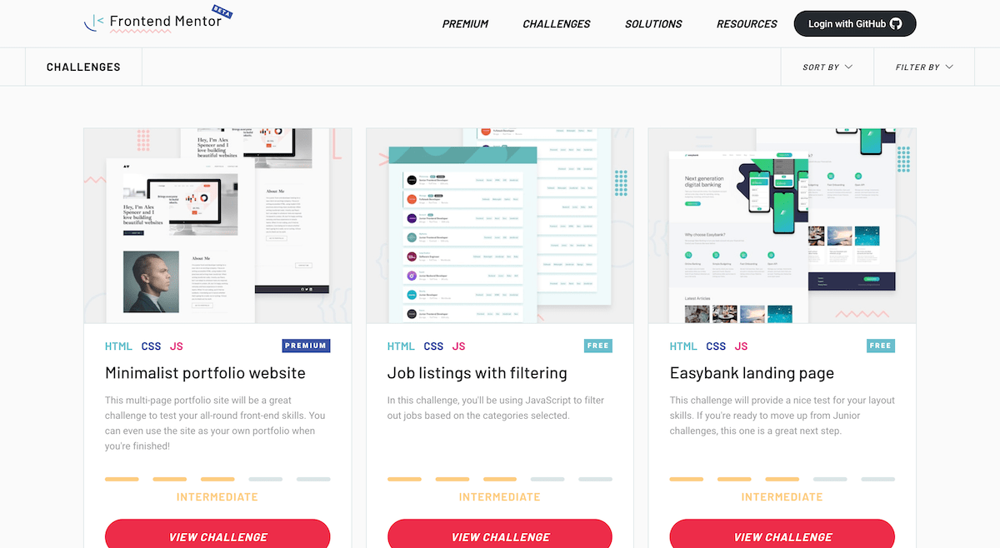

# Frontend Mentor - Challenges

## Welcome! 👋

Thanks for checking out this front-end coding challenges list.

[Frontend Mentor](https://www.frontendmentor.io) challenges allow you to improve your skills in a real-life workflow.

## CHALLENGES

## Newbie
- [Profile card component](./profile-card-component-main#README.md) - HTML, CSS.
- [Article preview component](./article-preview-component-master#README.md) - HTML, CSS and a tiny bit of JavaScript.
- [Huddle landing page with a single introductory section](./huddle-landing-page-with-single-introductory-section-master#README.md) - HTML, CSS and a tiny bit of JavaScript.
- [Ping single column coming soon page](./ping-coming-soon-page-master#README.md) - HTML, SCSS and a tiny bit of JavaScript, in my solution add a thank you page for subscribers.
- [Single price grid component](./single-price-grid-component-master#README.md) - HTML, SCSS 
- [Intro component with sign-up form](./intro-component-with-signup-form-master#README.md) - Sign-up form complete with client-side validation using JavaScript.
- [Base Apparel coming soon page](./base-apparel-coming-soon-master#README.md) - Basic form validation with JavaScript.
- [Four card feature section](./four-card-feature-section-master#README.md) - Multi-column and responsive layouts.
- [Coding bootcamp testimonials slider](./coding-bootcamp-testimonials-slider-master#README.md) - Great opportunity to play with animations and content transitions.
- [FAQ accordion card](./faq-accordion-card-main#README.md) - Building out an FAQ accordion.
- [Social proof section](https://alcs-social-proof.netlify.app) - Built with Flexbox.

## Means

- [https://photoshop.adobe.com/](https://photoshop.adobe.com/)
- [page-ruler-redux (extension)](https://chrome.google.com/webstore/detail/page-ruler-redux/giejhjebcalaheckengmchjekofhhmal)
- [colorpick (extension)](https://chrome.google.com/webstore/detail/colorpick-eyedropper/ohcpnigalekghcmgcdcenkpelffpdolg)
- [normalize.css](https://necolas.github.io/normalize.css/)
- [Fonts](https://fonts.google.com/)
- [sass](https://sass-lang.com/guide)
- [main](https://developer.mozilla.org/es/docs/Web/HTML/Elemento/main)
- [article](https://developer.mozilla.org/es/docs/Web/HTML/Elemento/article/)
- [color hsl](https://developer.mozilla.org/es/docs/Web/CSS/color_value)
- [flexbox](https://css-tricks.com/snippets/css/a-guide-to-flexbox/)

## Sharing your solution

There are multiple places you can share your solution:

1. Submit it on the platform so that other users will see your solution on the site. Here's our ["Complete guide to submitting solutions"](https://medium.com/frontend-mentor/a-complete-guide-to-submitting-solutions-on-frontend-mentor-ac6384162248) to help you do that.
2. Share your solution page in the **#finished-projects** channel of the [Slack community](https://www.frontendmentor.io/slack).
3. Tweet [@frontendmentor](https://twitter.com/frontendmentor) and mention **@frontendmentor** including the repo and live URLs in the tweet. We'd love to take a look at what you've built and help share it around.

## Giving feedback

Feedback is always welcome, so if you have any to give on this challenge please email hi[at]frontendmentor[dot]io.

This challenge is completely free. Please share it with anyone who will find it useful for practice.

**Have fun building!** 🚀

